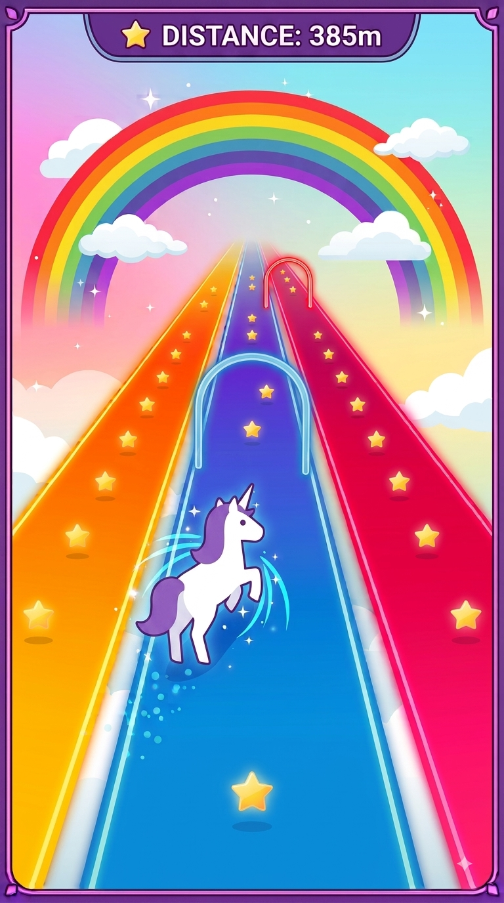

# 🌈 Rainbow Runner

Quick-reaction 3-lane action! Dodge hazards, snatch stars, and trigger powerful boosts—all with simple **Left** and **Right** controls.

Entry for https://js13kgames.com/2026/ 🦄🌈 Unicorns and Rainbows

## ⚡ Core Gameplay

* **3-Lane Movement:** Smoothly snap between **Left**, **Center**, and **Right** lanes to navigate the track.
* **Dynamic Speed:** The track continuously speeds up over time, ramping up the challenge.
* **Fever Multiplier:** Collect stars without missing to fill your streak meter and unlock $2\times$ and $3\times$ score multipliers.

## 🌟 The 3 Power-Ups

| Power-Up | Effect |
| :--- | :--- |
| 🧲 **Star Magnet** | Pulls all stars from nearby lanes directly toward you for **5 seconds**. |
| ⚡ **Rainbow Rush** | Boosts speed, makes you **invincible**, and turns all incoming hazards into stars for **3 seconds**. |
| 🛡️ **Cloud Shield** | Grants a **1-hit safety net** that absorbs your next crash against any obstacle. |

## 🌩️ The 3 Hazards

| Hazard | Effect / Tactical Role |
| :--- | :--- |
| 🌈 **Color Gate** | A glowing arch across the lane. Passable only if your active color matches the gate—otherwise, dodge! |
| 🌩️ **Storm Cloud** | Blocks a **single lane**. Perform a quick reactive dodge into either open lane. |
| 🚧 **Dual Barrier** | Blocks **two lanes at once**. Tests your precision under tight pressure to find the single opening. |

